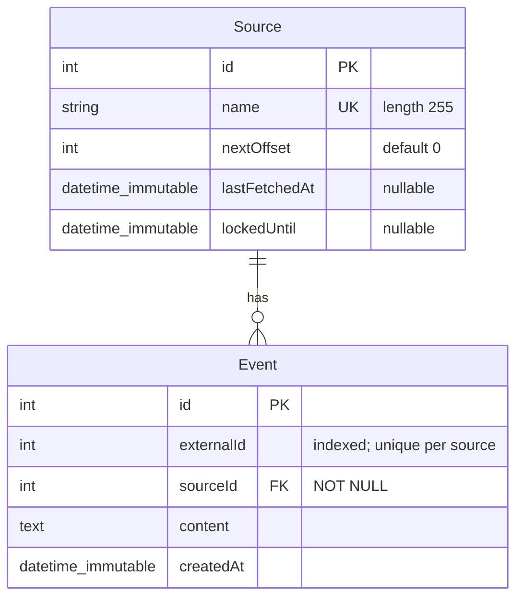

### Notes

- **`Source.name`** is unique — it's the natural key used by
  `EventLoaderInterface::supports()` to route a source to the correct loader.
- **`Source.nextOffset`** stores the last event ID already persisted from
  this source. The next fetch asks the upstream for events with
  `id > nextOffset`.
- **`Source.lastFetchedAt`** drives two things: round-robin ordering
  (`ORDER BY lastFetchedAt ASC` in `acquireNext`) and the 200 ms per-source
  cooldown predicate.
- **`Source.lockedUntil`** is the soft lock that prevents peer workers from
  picking up the same source during an in-flight fetch. `NULL` means "free".
- **`Event.externalId`** is *not* globally unique — it is unique **per
  source**. The DB enforces this with a composite unique constraint on
  `(external_id, source_id)` (`unique_external_id_source`) plus a
  standalone index on `external_id` (`idx_external_id`) for lookups.
- **`Event.source`** is a `ManyToOne` to `Source` (FK `source_id`, NOT NULL).
  No cascade is declared — event deletion does not propagate to sources.
```
