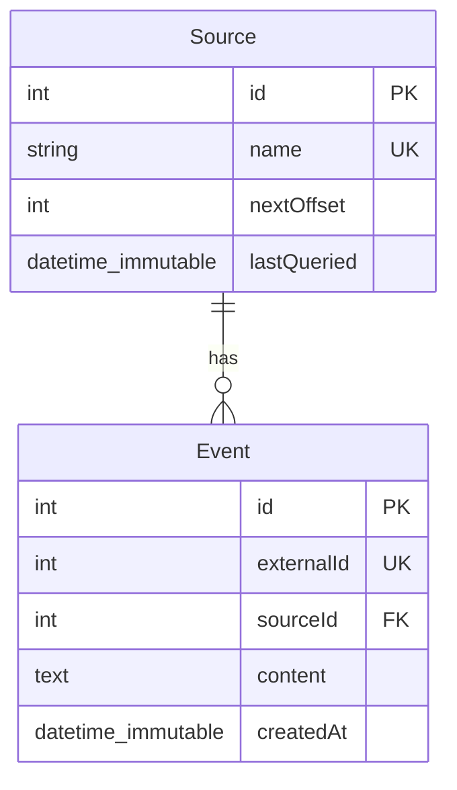

```mermaid
erDiagram
    Source {
        int id PK
        string name UK
        int nextOffset
        datetime_immutable lastQueried
    }

    Event {
        int id PK
        int externalId UK
        int sourceId FK
        text content
        datetime_immutable createdAt
    }

    Source ||--o{ Event : "has"
```
