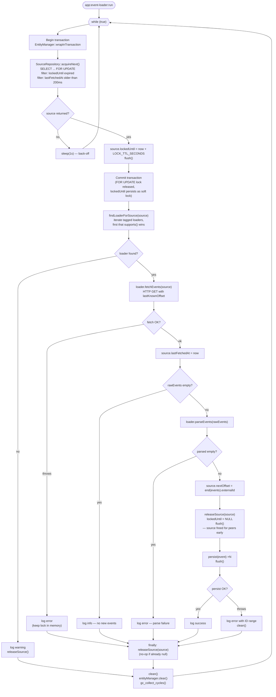
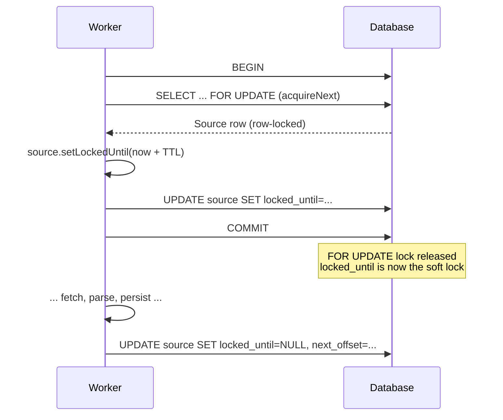

# Event Loader — Process Flow

End-to-end documentation of the event loading pipeline, starting from the
`app:event-loader:run` console command and tracing every component it
coordinates. The system is designed to run as **multiple concurrent workers**
(possibly on different servers) pulling events from multiple remote sources
without duplicating network requests or lost events.

---

## 1. Component map

| Component | Responsibility                                                                                                                                                  |
|---|-----------------------------------------------------------------------------------------------------------------------------------------------------------------|
| `EventLoaderOrchestratorCommand` (`src/Command/`) | Entry point. Runs an infinite round-robin loop that acquires a source, delegates to the right loader, persists results, and releases the source.                |
| `SourceRepository::acquireNext()` (`src/Repository/`) | Atomic, cross-worker safe "pick the next source I'm allowed to touch" primitive. Uses a `SELECT … FOR UPDATE` with lock-TTL and per-source cooldown predicates. |
| `EventLoaderInterface` (`src/Service/`) | Transport-agnostic contract with three methods: `fetchEvents`, `parseEvents`, `supports`.                                                                       |
| `EventLoaderSourceA` (`src/Service/`) | Example implementation. Uses a scoped Symfony HTTP client whose max duration is set by `HTTP_CLIENT_TIMEOUT` env var.                                           |
| `Source` entity (`src/Entity/`) | Row-per-source state: `name`, `nextOffset`, `lastFetchedAt`, `lockedUntil`.                                                                                     |
| `Event` entity (`src/Entity/`) | The ingested event. Unique on `(externalId, sourceId)` as a DB-level last-line defense against duplicates.                                                      |
| `EntityManagerInterface` (Doctrine) | Persistence + transaction boundary holder. `wrapInTransaction` is how the acquire-and-lock step is made atomic.                                                 |

---

## 2. High-level flow



---

## 3. The command: `EventLoaderOrchestratorCommand::execute`

The command is the **only stateful coordinator**. Its loop body is built from
three phases: **acquire**, **process**, **release**.

### 3.1 Acquire phase

```php
$this->entityManager->wrapInTransaction(function () use (&$source): void {
    $source = $this->sourceRepository->acquireNext();
    if ($source === null) { return; }
    $source->setLockedUntil(new \DateTimeImmutable('+' . self::LOCK_TTL_SECONDS . ' seconds'));
    $this->entityManager->flush();
});
```

Everything inside `wrapInTransaction` runs under a single DB transaction.
The `SELECT … FOR UPDATE` issued by `acquireNext()` holds a **row-level write
lock** on the chosen source row *until the transaction commits*. This prevents
two workers from reading the same row at the same instant and racing on the
`lockedUntil` update.

Once `lockedUntil` is flushed and the transaction commits, the **soft lock**
takes over: the row is now "locked" at the application level for
`LOCK_TTL_SECONDS` seconds, visible to every worker via the `lockedUntil`
column. The pessimistic lock is no longer needed.

### 3.2 No-source back-off

When `acquireNext()` returns `null` (all sources are currently locked by
peers, or none are configured yet), the command sleeps 1 s and retries —
it does **not** exit. This is what makes the loader a true long-running
daemon, matching the spec's "infinite loop" requirement.

### 3.3 Loader resolution

```php
$loader = $this->findLoaderForSource($source);
```

The command receives an `iterable<EventLoaderInterface>` via
`#[AutowireIterator('app.event_loader')]`. Each service tagged with
`app.event_loader` is inspected via `supports($source)` — the first one
claiming the source wins. If none claim it, the source is released and the
loop moves on; the lock does not leak.

### 3.4 Process phase (happy path)

1. `fetchEvents(source)` — one HTTP GET; must finish in `< LOCK_TTL_SECONDS`.
2. Update `lastFetchedAt = now`. This powers both:
   - the 200 ms per-source cooldown filter in `acquireNext`,
   - and the round-robin "oldest first" ordering.
3. `parseEvents(rawEvents)` — format conversion into `Event` entities.
4. `source.nextOffset = end($events)->getExternalId()` — advance the offset
   to the **last** known event for that source(the next
   fetch will ask `WHERE id > nextOffset`).
5. **Release the lock early** (`releaseSource`). Once the offset is advanced
   and persisted, no other worker will re-transport the same range, so the
   source can be handed back to peers before we spend time on local persists.
6. Persist events and flush. If this fails, the ID range is logged for
   manual replay; advancing the offset before persisting is a deliberate
   trade-off documented below.

### 3.5 Release phase (`finally`)

```php
finally {
    $this->releaseSource($source);
}
```

`releaseSource` is idempotent — if `lockedUntil` is already `null`
(happy path released it early), it short-circuits. If a throw happened
mid-fetch, this is the only code that guarantees the lock gets cleared
so another worker can pick the source and retry the events fetch.

### 3.6 Clean phase

```php
private function clean(): void
{
    $this->entityManager->clear();
    \gc_collect_cycles();
}
```

Because the daemon is long-running, any entity that survives past the end of
an iteration is a memory leak. `clear()` detaches everything in Doctrine's
identity map; `gc_collect_cycles()` reclaims cyclic references (e.g. Doctrine
proxy/collection graphs) that the refcount GC alone would not free.

---

## 4. `SourceRepository::acquireNext`

```php
$now = new \DateTimeImmutable();
$cooldownCutoff = $now->modify('-200 milliseconds');

return $this->createQueryBuilder('s')
    ->where('s.lockedUntil IS NULL OR s.lockedUntil < :now')
    ->andWhere('s.lastFetchedAt IS NULL OR s.lastFetchedAt < :cooldownCutoff')
    ->setParameter('now', $now)
    ->setParameter('cooldownCutoff', $cooldownCutoff)
    ->orderBy('s.lastFetchedAt', 'ASC')
    ->setMaxResults(1)
    ->getQuery()
    ->setLockMode(LockMode::PESSIMISTIC_WRITE)
    ->getOneOrNullResult();
```

This single query carries four concerns simultaneously:

| Concern | How it's enforced |
|---|---|
| **Mutual exclusion** between workers | `PESSIMISTIC_WRITE` → `SELECT … FOR UPDATE`. Must be called inside a transaction so the row-lock outlives the SELECT and covers the subsequent `lockedUntil` write. |
| **Respect peer soft locks** | `lockedUntil IS NULL OR lockedUntil < now`. A peer that holds a valid soft lock is invisible here. |
| **200 ms per-source cooldown** | `lastFetchedAt IS NULL OR lastFetchedAt < now − 200 ms`. Enforced at the DB so it holds across servers. Satisfies the spec's "≥ 200 ms between two consecutive requests to the same source" requirement. |
| **Round-robin fairness** | `ORDER BY lastFetchedAt ASC`. The least-recently-fetched source is picked first. After a fetch, that source's timestamp becomes the newest, so the next iteration rotates to a different one. |

### 4.1 Interaction with the command's transaction



This split — **short pessimistic lock** for the acquire, **long soft lock**
for the work — is deliberate. Holding the pessimistic lock for the entire
fetch would block the `SELECT … FOR UPDATE` of every peer worker, defeating
parallelism.

---

## 5. `EventLoaderInterface`

```php
interface EventLoaderInterface
{
    public function fetchEvents(Source $source): array;   // raw transport payload
    public function parseEvents(array $events): array;    // -> array<int, Event>
    public function supports(Source $source): bool;       // loader ↔ source dispatch
}
```

### Design rationale

- **Transport/format agnostic.** The interface returns `array<int, mixed>`
  from `fetchEvents`; the orchestrator never touches the payload shape. An
  implementation can use HTTP+JSON (as `EventLoaderSourceA` does), gRPC,
  message queues, or anything else.
- **Separation of fetch and parse.** Keeps I/O distinct from pure
  transformation — `parseEvents` is trivially unit-testable without a
  network.
- **`supports` → polymorphic dispatch.** The orchestrator does not care how
  many loaders exist; it only needs "give me the one that handles this
  source". New sources are added by registering a new tagged service;
  orchestrator code stays untouched (open-closed).

### 5.1 Per-implementation contract

Beyond the method signatures, every implementation **must** also:

1. Configure its transport with a **hard timeout strictly shorter than
   `LOCK_TTL_SECONDS`** (60 s). `EventLoaderSourceA` documents this
   invariant in its docblock. Violating it risks the lock expiring
   mid-fetch and a peer re-transporting the same events — the exact
   conflict the spec forbids.
2. Throw on any non-2xx response or transport error. The orchestrator's
   outer `try/catch` relies on exceptions to decide "this was an error,
   skip and log".

---

## 6. `EventLoaderSourceA` (example implementation)

```php
$response = $this->clientSourceA->request('GET', '/events', [
    'query' => ['lastKnownOffset' => $source->getNextOffset()],
]);
```

The `$clientSourceA` is an HTTP client *scoped for Source A* (configured
in `config/packages/http_client.yaml` via `scoped_clients`).
The scope is where the `base_uri`, auth headers, and — critically — the
**max duration** live. Because the scope is per-source, the timeout can be
tuned per-upstream without affecting other loaders.

`fetchEvents` is a Source-A specific concern: it knows how to ask Source A for events using the
`lastKnownOffset` query parameter. It also throws if the response is not a 2xx, satisfying the contract.

`parseEvents` is a Source-A-specific concern: it maps the remote
JSON schema into `App\Entity\Event` instances. The docblock documents the
intent (Symfony Serializer) even though the sample returns `[]`.

`supports` does a name match against the `Source.name` column. This
column is the single source-of-truth for loader↔source dispatch.

---

## 7. Error-handling matrix

| Failure point | What happens | Side effects |
|---|---|---|
| No source available | `acquireNext` returns `null` → `sleep(1)` → retry | None. |
| Unknown source (no loader `supports` it) | Log warning, `releaseSource`, continue | Lock freed immediately. No state change. |
| Network / server error in `fetchEvents` | Outer `catch` logs error. `finally` releases lock. | `lastFetchedAt` **not** updated — source becomes eligible again immediately (subject to 200 ms cooldown) so a healthy retry is possible. Spec-compliant "skip and log". |
| Empty raw response | Logged as info. Released. | `lastFetchedAt` **is** updated (fetch succeeded; just no new events). Source rotates to the back of the round-robin queue. |
| `parseEvents` returned empty despite non-empty raw | Logged as error. `continue`. | `lastFetchedAt` updated. Lock released in `finally`. |
| Persist / flush throws *after* offset advanced and lock released | Inner `catch` logs the lost ID range. `clean()` is called to discard dirty state. | **Data loss trade-off:** offset already moved past this range in DB, so subsequent runs won't re-fetch. The range is printed to the error log for manual replay. The trade is deliberate — it avoids the bigger risk of a peer double-transporting the range. |

---
